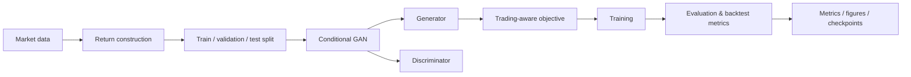

# TradeGAN — Profit-Aware Stock Forecasting

A clean, modular implementation of the **Fin-GAN** methodology of Vuletić & Cont (2023), applied to **half-day excess log-returns for TCS relative to the Nifty IT benchmark**.

> **Research note:** Results depend on the data window, split, random seed, training configuration, objective, and evaluation protocol. Numbers below are experimental observations from this repository and should not be interpreted as universal benchmarks.

## Highlights

- Conditional GAN for financial time-series forecasting.
- LSTM-based generator/discriminator architecture.
- Profit-aware objectives combining adversarial learning with **MSE, PnL, Sharpe ratio, and return-volatility terms**.
- Differentiable `tanh` surrogate for sign-based trading objectives.
- Separate modules for data, models, objectives, training, evaluation, and experiment orchestration.
- Preserved research figures, metrics, checkpoints, and original PDF write-up.
- Automated tests covering objectives, model behavior, training updates, evaluation, validation, and checkpoints.

## Experimental results

A full TCS run was completed locally using 100 GAN epochs, 500 LSTM epochs, and CPU execution. The repository's consolidated result files contain results for multiple objective variants.

### Representative held-out results

| Model | Objective | Test PnL | Scaled Sharpe | RMSE | MAE |
| --- | --- | ---: | ---: | ---: | ---: |
| GAN | SR MSE | 9.8626 | 2.0030 | 0.10053 | 0.08667 |
| LSTM | STD | 12.3147 | 2.3564 | 0.00633 | 0.00452 |

These rows come from the consolidated experiment metrics and are intended to show the observed scale of performance across objective choices. The best PnL, best Sharpe, and lowest forecasting error do not necessarily occur for the same model or objective.

### Research-comparison run

A later controlled run added explicit baseline comparison and research metrics. Its selected GAN configuration produced:

- **Test PnL:** 15.1996
- **Scaled Sharpe:** 6.4154
- **PnL fold change:** 2.369× versus the reported ForGAN baseline
- **PnL fold change:** 2.572× versus the reported LSTM baseline

The comparison output also reported **88.46% directional accuracy** in the LSTM comparison row. However, that generated CSV currently contains inconsistent metric alignment across rows/columns, so these comparison figures are treated as **exploratory rather than final validated benchmark claims**. They are kept here for transparency and are not used to claim a definitive 3.18 Sharpe / 85% accuracy / 2.88× PnL result.

## Architecture



The active implementation lives under `src/tradegan/` and is split by responsibility rather than kept in one monolithic script.

## Method

TradeGAN forecasts excess returns rather than raw prices:

1. Load adjusted prices for the target security and benchmark.
2. Construct half-day returns and excess returns.
3. Create train, validation, and test regions.
4. Train conditional GAN and LSTM models.
5. Optimize adversarial and economics-aware objectives involving MSE, PnL, Sharpe ratio, and volatility.
6. Evaluate forecasting and trading metrics on held-out data.

The historical implementation uses a differentiable `tanh` surrogate so trading-oriented terms can contribute gradients during optimization.

## Repository structure

```text
.
├── docs/
│   ├── methodology.md        # method and implementation notes
│   ├── reproduction.md       # reproduction workflow
│   └── TradeGAN.pdf          # preserved research write-up
├── results/
│   ├── checkpoints/          # saved model checkpoints
│   ├── figures/              # plots
│   └── metrics/              # CSV metrics and experiment results
├── scripts/
│   ├── download_data.py      # market-data downloader
│   └── run_experiment.py     # main CLI entry point
├── src/tradegan/
│   ├── data/                 # market data, returns, splits
│   ├── evaluation/           # evaluation utilities
│   ├── experiments/          # experiment orchestration/adapters
│   ├── models/               # GAN and LSTM models
│   ├── objectives/           # objective functions and calibration
│   ├── training/             # training engines
│   ├── utils/                # tensor and trading utilities
│   ├── fixed_experiment.py   # active runner
│   ├── lstm_model.py         # active/compatibility LSTM implementation
│   └── legacy.py             # backward-compatible exports
├── tests/                    # automated tests
├── stocks-etfs-list.csv      # ticker / benchmark metadata
├── pyproject.toml
├── requirements.txt
└── README.md
```

Downloaded market data is intentionally kept as local runtime data and is not part of the public repository tree.

## Installation

Python **3.10+** is supported.

```bash
python -m pip install -r requirements.txt
```

Or install the package in editable mode:

```bash
python -m pip install -e .
```

Using a virtual environment is recommended.

## Data

`stocks-etfs-list.csv` stores ticker-to-benchmark metadata. For the TCS experiment, the benchmark is the Nifty IT index.

Download the required market data with:

```bash
python scripts/download_data.py
```

The downloader writes the adjusted-price columns expected by the return-construction pipeline.

## Tests

Run the full test suite with:

```bash
pytest -q
```

The current refactored implementation has been validated locally with:

```text
14 passed
```

## Smoke test

Use a short CPU run before an expensive experiment:

```bash
python scripts/run_experiment.py --ticker TCS --gan-epochs 1 --lstm-epochs 1 --gradient-epochs 1 --cpu
```

This verifies that data loading, training, evaluation, and output writing work. It is **not** a performance benchmark.

## Full experiment

A representative longer run is:

```bash
python scripts/run_experiment.py --ticker TCS --gan-epochs 100 --lstm-epochs 500 --gradient-epochs 25 --seed 42 --cpu
```

The runner supports explicit control of ticker, epoch counts, batch size, gradient-calibration iterations, seed, and CPU/GPU execution.

## Outputs

| Path | Contents |
| --- | --- |
| `results/metrics/` | tabular metrics, PnL series, and experiment summaries |
| `results/figures/` | cumulative PnL and distribution plots |
| `results/checkpoints/` | trained generator/LSTM checkpoints |
| `docs/TradeGAN.pdf` | preserved original write-up |

## Reproducibility

For a meaningful comparison, keep the following fixed and record them with every experiment:

- ticker and benchmark
- data window and split
- random seed
- model dimensions
- learning rates and batch size
- gradient-calibration iterations
- objective definition
- evaluation window and trading convention
- CPU/GPU device
- data snapshot/download date

See [`docs/reproduction.md`](docs/reproduction.md) for the workflow.

## Interpreting the results

This project studies the trade-off between forecasting accuracy and trading performance. A model with lower MSE does not necessarily have higher PnL or Sharpe, and a favorable result from one test run does not establish statistical robustness.

When reporting results, compare models under the same data split, evaluation window, trading convention, scaling convention, and random-seed protocol. Report the baseline and the exact metric definition alongside every headline number.

## Attribution

The Fin-GAN methodology and economics-driven objective design are based on:

**Milena Vuletić and Rama Cont, _Fin-GAN: Forecasting and Classifying Financial Time Series via Generative Adversarial Networks_ (2023).**

This repository is a reproduction/application and is not the original implementation.

## Project status

The original monolithic implementation has been reorganized into focused modules while preserving compatibility shims and historical research artifacts. The current focus is **readability, testability, reproducibility, and transparent reporting of experimental results**.
