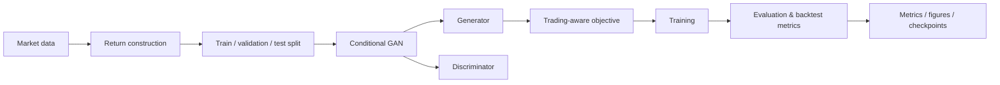

# TradeGAN — Profit-Aware Stock Forecasting

A clean, modular reproduction/application of the **Fin-GAN** methodology of Vuletić & Cont (2023), applied to **half-day excess log-returns for TCS relative to the Nifty IT benchmark**.

> **Research note:** This repository is intended for reproducible experimentation and engineering study. Reported performance depends on the dataset, split, seed, hyperparameters, and evaluation procedure. The numerical results below are from a documented local TCS run and should not be generalized to other assets or time periods.

## Highlights

- Conditional GAN for financial time-series forecasting.
- LSTM-based generator and discriminator following the ForGAN-style architecture used by the project.
- Profit-aware objectives combining adversarial loss with **MSE, PnL, Sharpe-ratio, and volatility** terms.
- Differentiable trading-sign surrogate for economics-aware objectives.
- Separate modules for data preparation, models, objectives, training, evaluation, and experiment orchestration.
- Historical figures, metrics, checkpoints, and the original PDF write-up preserved under `results/` and `docs/`.
- Automated tests covering core objectives, model behavior, training updates, evaluation, validation, and checkpoint round-trips.

## Verified local results

A full TCS experiment was run locally with **100 GAN epochs, 500 LSTM epochs, 10 gradient-calibration epochs, and CPU execution**. The run completed successfully and produced the expected metrics, figures, and checkpoints.

The best observed held-out metrics among the objective variants in that run were:

| Model | Best objective | Test PnL | Test scaled Sharpe | Test RMSE | Test MAE |
| --- | --- | ---: | ---: | ---: | ---: |
| GAN | MSE | 9.4884 | 1.8527 | 0.00649 | 0.00470 |
| LSTM | STD | 12.3147 | 2.3564 | 0.00633 | 0.00452 |

These are **run-specific observations**, not claims of statistical significance or out-of-sample generalization. The experiment evaluates multiple objectives, so the best metric depends on which objective is selected. In particular, lower forecasting error does not automatically imply better trading performance.

The current repository does **not** report a verified 3.18 Sharpe ratio or 85% directional accuracy. Directional accuracy is not currently a directly computed metric in the consolidated result tables, so it should not be inferred from the positive/negative prediction proportions.

## Architecture



The active implementation is organized as a Python package under `src/tradegan/` rather than a single monolithic training script.

## Method

TradeGAN forecasts excess returns rather than raw prices. The workflow is broadly:

1. Load adjusted market prices for the target security and benchmark.
2. Construct half-day returns and excess returns.
3. Split the series into training, validation, and test regions.
4. Train a conditional GAN with LSTM generator/discriminator components.
5. Optimize either the adversarial objective alone or economics-aware combinations involving:
   - mean squared error (MSE)
   - profit and loss (PnL)
   - Sharpe ratio (SR)
   - return volatility / standard deviation (STD)
6. Evaluate forecasts and trading-oriented metrics on held-out data.

The historical implementation uses a differentiable `tanh` surrogate for sign-based trading objectives so that PnL/Sharpe-related terms can contribute gradients during training.

## Repository structure

```text
.
├── configs/
│   ├── default.yaml          # reference experiment settings
│   └── README.md
├── data/
│   └── README.md             # local market-data guidance
├── docs/
│   ├── methodology.md        # method and implementation notes
│   ├── reproduction.md       # reproduction workflow
│   └── TradeGAN.pdf          # preserved original write-up
├── experiments/
│   └── README.md
├── results/
│   ├── checkpoints/          # saved model checkpoints
│   ├── figures/              # generated / archived plots
│   ├── metrics/              # CSV metrics and experiment summaries
│   └── README.md
├── scripts/
│   ├── download_data.py      # market-data downloader
│   ├── run_experiment.py     # main CLI entry point
│   └── README.md
├── src/tradegan/
│   ├── data/                 # market data, returns, splits
│   ├── evaluation/           # evaluation and backtest metrics
│   ├── experiments/          # experiment adapters
│   ├── models/               # GAN/LSTM model definitions
│   ├── objectives/           # objective functions and calibration
│   ├── training/             # shared training engines
│   ├── utils/                # tensor and trading utilities
│   ├── fixed_experiment.py   # active experiment runner
│   └── legacy.py             # compatibility re-exports
├── tests/                    # automated tests
├── stocks-etfs-list.csv      # ticker / benchmark metadata
├── pyproject.toml
├── requirements.txt
└── README.md
```

## Installation

Python **3.10+** is supported.

### Option A — install dependencies

```bash
python -m pip install -r requirements.txt
```

### Option B — install the package in editable mode

```bash
python -m pip install -e .
```

Using a virtual environment is recommended.

## Data

`stocks-etfs-list.csv` stores ticker-to-benchmark metadata used by the project. For the TCS experiment, the benchmark mapping is the Nifty IT index.

Download market data with:

```bash
python scripts/download_data.py
```

Downloaded market data is treated as **local runtime data** and should not be committed. The downloader writes the adjusted-price columns expected by the return-construction pipeline.

## Run the tests

The test suite is the fastest way to verify the installation and core implementation:

```bash
pytest -q
```

The refactored project has been validated locally with:

```text
14 passed
```

## Run a smoke test

Before a long training run, use a short CPU run:

```bash
python scripts/run_experiment.py --ticker TCS --gan-epochs 1 --lstm-epochs 1 --gradient-epochs 1 --cpu
```

This checks that the end-to-end pipeline can load data, train the objectives, evaluate the models, and write outputs. **It is a pipeline test, not a performance benchmark.**

## Run a longer experiment

For a substantial TCS experiment:

```bash
python scripts/run_experiment.py \
  --ticker TCS \
  --gan-epochs 100 \
  --lstm-epochs 500 \
  --gradient-epochs 100
```

For CPU-only execution, append `--cpu`:

```bash
python scripts/run_experiment.py --ticker TCS --gan-epochs 100 --lstm-epochs 500 --gradient-epochs 100 --cpu
```

The verified local results above used `--gradient-epochs 10`. The runner is currently **CLI-driven**. `configs/default.yaml` documents the intended configuration, but the current runner does not automatically load that YAML file.

## Outputs

Experiment outputs are separated from source code:

| Path | Contents |
| --- | --- |
| `results/metrics/` | CSV metrics and experiment summaries |
| `results/figures/` | cumulative PnL, return, and distribution plots |
| `results/checkpoints/` | trained generator/LSTM checkpoints |
| `docs/TradeGAN.pdf` | preserved original write-up |

The repository intentionally keeps archived research artifacts separate from implementation code.

## Reproducibility

For a reproducible experiment, record at minimum:

- ticker and benchmark
- training / validation / test split
- GAN and LSTM epoch counts
- learning rates
- model dimensions
- objective being optimized
- random seed
- device (`cpu` / `cuda`)
- data snapshot or download date

The current codebase has a dedicated reproduction guide in [`docs/reproduction.md`](docs/reproduction.md). The one-epoch smoke test should not be used to support research performance claims.

## Results interpretation

The repository contains multiple objective variants because the project studies the trade-off between forecast accuracy and trading performance. A lower MSE does not necessarily imply a higher PnL or Sharpe ratio, and a higher PnL does not by itself establish statistical robustness.

When reporting results, compare models using the same:

- data split
- evaluation window
- trading convention
- scaling convention
- objective definition
- random-seed protocol

Avoid presenting a single favorable metric without its evaluation context. The verified local results above should be treated as one experimental run, not as a universal benchmark.

## Attribution

The Fin-GAN methodology, model name, ForGAN-based architecture, and economics-driven generator objectives originate with:

**Milena Vuletić and Rama Cont, _Fin-GAN: Forecasting and Classifying Financial Time Series via Generative Adversarial Networks_ (2023).**

This repository is a reproduction/application and is not the original implementation.

## Project status

The codebase has been reorganized from the original monolithic implementation into focused modules while retaining a compatibility layer for historical imports and preserving the original research artifacts. The current focus is on **readability, testability, reproducibility, and transparent reporting of experimental results**.

## License / citation

See the repository for the applicable project and source-material licensing terms. When using or extending this work, please cite the original Fin-GAN research and distinguish reproduced results from newly generated experiments.
